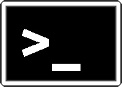

Linux shell 101
===============

##
Francisco Pina Martins

###
24/10/2013

---

A shell e "porque é que eu preciso disto" ?
==========================================

##O que é:

* Uma interface com o computador via "linha de comandos"
* *bash* (ksh zsh fish dash etc...)
* Acede-se através de um "terminal"
* Apesar de tudo o rato também é útil na shell

 

##Para que é que preciso dela?

* Servidores HPC
* Acesso remoto simples
* Interface **simples**
* Pode parecer que não, mas facilita imenso

##Não acreditam? Vejam.

---

O *prompt*
==========

``user@machine:~$``

``bash-4.1$``

---

Navegação e orientação
======================

##Pensem na vossa shell como um gestor de ficheiros

1. Onde é que eu estou?
2. O que é que há aqui?
3. Como é que me movimento?

``$ pwd``

``$ ls``

``$ cd``

##Significado:

1. print working directory
2. list
3. call directory

---

O vossos novos melhores amigos
==============================

``man nome_do_programa``

* **TODOS** os programas *builtin* na shell (coreutils) têm um
* Alguns outros também

``$ man ls``

``$ whatis ls``

##Tecla "Tab"

* Completa o que estão a escrever
* Com uma ou duas "*keypress*"

##Teclas ↓ e ↑

* Navegam pela lista de comandos anteriores

---

Caminhos (path) e convenções
============================

##Os caminhos podem ser absolutos ou relativos

##Ex. de caminhos absolutos
``/etc/fstab``

``~/Downloads/ficheiro.txt``

##Ex. de caminhos relativos
``Downloads/ficheiro.txt``

``./ficheiro.txt``

##Convenções comuns

* ~ -> *home dir*, por ex. ``/home/francisco``
* ./ -> "Aqui"
* ../ -> Um diretório abaixo
* ../../ -> Dois diretórios abaixo
* .ficheiro -> Ficheiro "escondido"

---

Navegação II
============

1. Como é que eu crio um novo diretório (pasta)?
2. Como é que eu apago um novo diretório?
3. Como é que eu crio um novo ficheiro?
4. Como é que eu copio um ficheiro?
5. Como é que eu movo um ficheiro?
6. Como é que eu apago um ficheiro

``$ mkdir dir_name``

``$ rmdir dir_name``

``$ touch file_name``

``$ cp origem destino``

``$ mv origem destino``

``$ rm file_name``

---

#
Intervalo!

---

Permissões
==========

##Todos os ficheiros têm uma série de atributos.

``drwxr-xr-x  5 francisco francisco 4096 Oct 22 00:24 Desktop``

``drwxr-xr-x  3 francisco cobig2    4096 2013-05-20 13:55 Databases``

``-rw-r--r-- 1 francisco francisco 4256 Sep 15  2011 Zkill.py``

* user
* group
* others

##Valores

* read (4)
* write (2)
* execute (1)

``$ groups``

---

Permissões II
=============

##Ok, e como é que eu mudo isto?

``$ chown user:group ficheiro``

``$ chmod mode ficheiro``

##Usamos as somas dos valores

1 - execute only

4 - read only

5 - read&execute

6 - read&write

7 - read,write&execute

##Ou um valor verbal

``$ chmod +x ficheiro``
``$ chmod o-w ficheiro``

---

Variáveis de ambiente e  outros *goodies*
=========================================

##``env vars``

	!bash
	i="ola"
	echo $i
	echo $USER
	echo $HOME

##Aliases

	!bash
	alias ll=ls -l
	ll

##Para tornar permanente basta adicionar a ``~/.bashrc``

##Unix pipe ``|``

##Podemos "pipar" o resultado de um comando para outro

	!bash
	du -sm *
	du -sm *| sort
	du -sm *| sort -r

##As possibilidades são ilimitadas!

---

$PATH
=====

##Correr programas

* É boa prática colocar os programas a correr no $PATH

``$ echo $PATH``

---